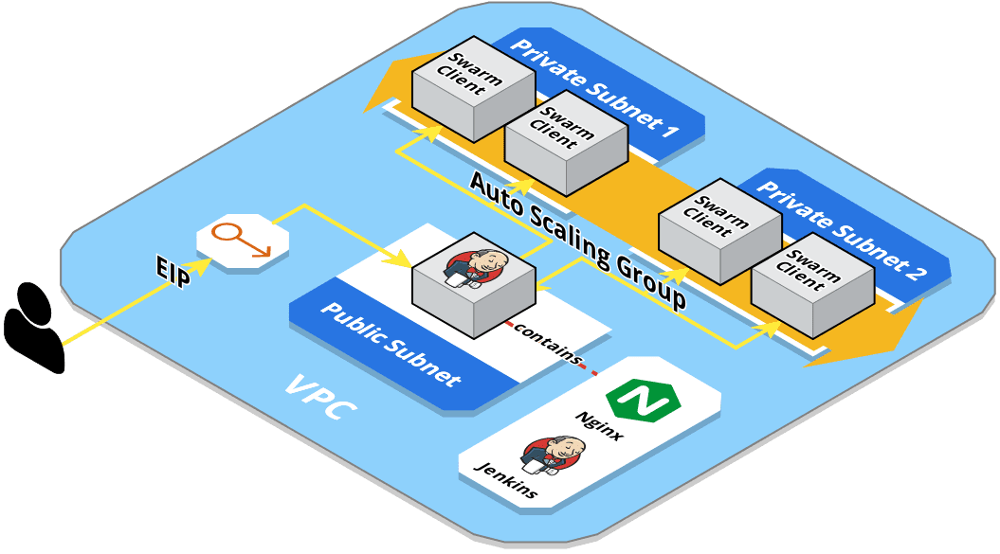

# AWS Jenkins

This project sets up an auto-scaling, highly available, and secure Jenkins cluster on AWS using Terraform. 
The standing feature behind this setup is the automatic scaling of the slaves' EC2 instances based on the build queue size.

## Table of Contents
1. [Implementation](#implementation)
2. [Requirements](#requirements)
3. [Usage](#usage)
4. [Demo](#demo)
5. [Configuration](#configuration)

## Implementation



The setup's architecture is shown in the above diagram. It includes the following components:
* A VPC with a configurable IPv4 block. Using a pre-created VPC is also possible through setting the `vpc_id` input variable.
* A public subnet for the internet facing EC2 instances (Jenkins master) and two private ones (for the slaves). Both are associated with network ACLs that control the traffic in and out.
* Connections (e.g. SSH) to the slaves can be only initiated from master, i.e. the master's instance acts as a bastion host. This is enforced both by security groups and network ACLs.
* The private subnet can connect to the internet through a NAT server, which is the master's instance in this setup (due to free tier limitations, but ideally it would be a different instance/NAT gateway).
* The bootstrapping of master and slaves is performed during the instance startup with cloud-init.
* A reverse-proxy (Nginx) runs on master and enforces HTTPS communication (self-signed ssl certificate). 
* Terraform generates a secure random password for the admin account, and stores it in Secrets Manager. This secret is only accessible by the master's instance (IAM role).
* An Auto Scaling group that manages the slaves.
* Using the [Swarm plugin](https://wiki.jenkins.io/display/JENKINS/Swarm+Plugin), the slaves are able to join master and manage their own configuration, thus simplifying scaling out/in the slaves.
* CloudWatch alarms that automatically:
  * Recover the master's instance in case of system failures.
  * Reboot master in case the Jenkins/Nginx services are down/not responding (metrics collected by CloudWatch agent using StatsD protocol).
  * Scale out the slaves in case there are builds waiting in the build queue (defaults to 2 builds waiting for at least 5 minutes).
  * Scale in the slaves in case the queue is empty for a while (defaults to at least 10 minutes).
* A termination lifecycle hook is in place to properly drain the slave before terminating it. Basically, each slave monitors its lifecycle state, if it's terminating (`Terminating:Wait`), then it marks itself as offline in order not to accept new builds. Moreover, if it's already running a build, it will keep extending the termination timeout period by recording a heartbeat, otherwise, it will complete the lifecycle action, which resumes the termination process.
* CloudWatch Logs stores the logs from master and slaves (collected by CloudWatch agent).
  
## Requirements
Before starting, the following needs to be present/installed on your machine:
* Terraform (used version 0.12.24, [guide](https://www.terraform.io/downloads.html)).
* `~/.aws/credentials` file containing your IAM user's access keys ([guide](https://docs.aws.amazon.com/cli/latest/userguide/cli-configure-files.html)).
* EC2 key pair for SSH access ([guide](https://docs.aws.amazon.com/AWSEC2/latest/UserGuide/ec2-key-pairs.html)).

## Usage
1. Clone the repository, and navigate to the clone directory.
2. Run Terraform:
   ```bash
   terraform init
   terraform apply -var key_pair_name=aws -var slave_count=3
   ```
   Where `key_pair_name` is the name of the key pair you created earlier, and `slave_count` is the desired number of slaves to launch (refer to the [configuration section](#configuration) below).
3. When finished, check the output, which would look like:
   ```
   Outputs:
   
   admin_pass = ****************
   jenkins_master_public_dns = ec2-35-157-225-150.eu-central-1.compute.amazonaws.com
   ```
4. Open the shown public domain name in your browser, and login as `admin` with the output password.
5. To SSH into one of the slaves, SSH first into the master instance and then into the slave, or shortly as:
   ```bash
   ssh -J admin@ec2-35-157-225-150.eu-central-1.compute.amazonaws.com admin@10.0.1.189
   ```
   to find out the private ips of the slaves, check the web console, or use the cli as:
   ```bash
   aws ec2 describe-instances --filter 'Name=tag:aws:autoscaling:groupName,Values=jenkins_slaves' \
     --query 'Reservations[*].Instances[*].[InstanceId,PrivateIpAddress,State.Name]' --output text
   ```
6. Finally, to delete and free up all used resources:
   ```bash
   terraform destroy
   ```

## Demo
For testing/demo purposes, you can run the same setup locally with Docker (used version 19.03.8-ce) and Docker Compose (used version 1.25.4) as follows:
```bash
cd ./playground
docker-compose up --build --force-recreate -V --scale slave=3
```
After that, open `https://localhost` in your browser, and login as `admin` with password `admin123`.

## Configuration
The following table lists the input variables of the Terraform module, and their default values:

| Variable                               | Description `Default`                                                                                                |
|----------------------------------------|----------------------------------------------------------------------------------------------------------------------|
| `region`                               | Name of the AWS region to use `eu-central-1`                                                                         |
| `key_pair_name`                        | Name of an EC2 key pair in the specified region `aws`                                                                |
| `vpc_id`                               | VPC id to use (if set, this module would skip creating one)                                                          |
| `ig_id`                                | Internet gateway id to use within the VPC (if set, this module would skip creating one)                              |
| `cidr_vpc`                             | IPv4 address block for the VPC (if one would be created) `10.0.0.0/16`                                               |
| `cidr_public_subnet`                   | IPv4 address block for the public subnet `10.0.1.0/24`                                                               |
| `cidr_private_subnet_1`                | IPv4 address block for the first private subnet `10.0.2.0/24`                                                        |
| `cidr_private_subnet_2`                | IPv4 address block for the second private subnet `10.0.3.0/24`                                                       |
| `jenkins_version`                      | Jenkins version to use `2.222.1`                                                                                     |
| `swarm_plugin_version`                 | Swarm plugin version to use `3.19`                                                                                   |
| `additional_plugins`                   | List of additional plugins to install <br/>`["git", "workflow-aggregator:2.6", "job-dsl:1.77"]`                      |
| `instance_type_master`                 | EC2 Instance type for the master `t2.micro`                                                                          |
| `instance_type_slave`                  | EC2 Instance type for a slave `t2.micro`                                                                             |
| `num_executors_master`                 | Number of executors on the master `1`                                                                                |
| `num_executors_slave`                  | Number of executors on a slave`2`                                                                                    |
| `slave_count`                          | Minimum number of slaves to have `1`                                                                                 |
| `slave_max_count`                      | Maximum number of slaves possible `3`                                                                                |
| `master_recover_system_failure_period` | Time period (in minutes) after which the master instance is recovered in case the system status check is failing `2` |
| `master_restart_service_down_period`   | Time period (in minutes) after which the master instance is restarted in case the Jenkins service is down `2`        |
| `slaves_scale_out_queue_size`          | Number of builds which, if the queue size exceeds/equals, triggers a scale out `2`                                   |
| `slaves_scale_out_queue_size_period`   | Time period (in minutes) over which the queue size constraint for scaling out is evaluated `5`                       |
| `slaves_scale_in_queue_size`           | Number of builds which, if the queue size goes below, triggers a scale in `1`                                        |
| `slaves_scale_in_queue_size_period`    | Time period (in minutes) over which the queue size constraint for scaling in is evaluated `10`                       |