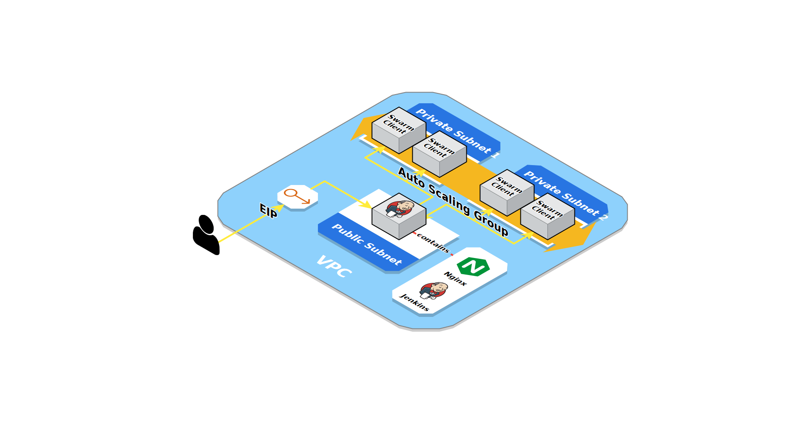

# AWS Jenkins

This project sets up a highly available, auto-scaling, and secure Jenkins cluster on AWS using Terraform. 

## Table of Contents
1. [Implementation](#implementation)
2. [Usage](#usage)
3. [Testing Locally](#testing-locally)
4. [Configuration](#configuration)

## Implementation
The setup's architecture is shown in the diagram to the right, with the following components:



* A VPC with an IPv4 block (10.0.0.0/16).
* A public subnet for the internet facing machines (Jenkins master) and a private one (for the slave machines). 
Moreover, the traffic in and out is controlled by network ACLs.
* Connections (e.g. SSH) to the slave machines can be only initiated from the master machine, i.e. the master acts as a bastion host. 
This is enforced both by security groups and network ACLs.
* The private subnet can connect to the internet through a NAT server, which is the master machine in this setup 
(due to free tier limitations, but ideally it would be a different machine).
* The bootstrapping of the master and the slaves is performed at the startup of the machines with cloud-init.
* A reverse-proxy (Nginx) runs on master and enforces HTTPS communication (self-signed ssl certificate). 
* Terraform generates a secure random password for the admin account, and only passes its hash to the master's init scripts. 
This way, the password is kept safe and does not leave the place where Terraform store's its state.
* An Auto Scaling group that manages and scales the slaves.
* Using the [Swarm plugin](https://wiki.jenkins.io/display/JENKINS/Swarm+Plugin), the slaves are able to join the master and manage their own configuration, 
thus simplifying scaling out/in the slaves.
* CloudWatch alarms that automatically:
  * Recover the master machine in case of system failures.
  * Reboot the master in case the jenkins service is down/not responding (metrics collected by CloudWatch agent using StatsD protocol).
  * Scale out the slaves in case there are builds waiting in the build queue (2 builds waiting for at least 5 minutes).
  * Scale in the slaves in case the queue is empty for a while (at least 10 minutes).
* A termination lifecycle hook is in place to properly drain the slave before terminating it. Basically, the slave monitors its lifecycle state, 
if it's terminating (`Terminating:Wait`), then it marks itself as offline in order not to accept new builds. Moreover, if it's already running a build, 
it will keep extending the termination timeout period by recording a heartbeat, otherwise, it will complete the lifecycle action, which resumes the termination process. 
* CloudWatch Logs stores the logs from master and slaves (collected by CloudWatch agent).
  
## Usage
To setup the cluster on AWS, the following needs to be present/installed on your machine:
* Terraform (used version 0.12.24, [guide](https://www.terraform.io/downloads.html))
* `~/.aws/credentials` file containing your IAM user's access keys. ([guide](https://docs.aws.amazon.com/cli/latest/userguide/cli-configure-files.html))
* EC2 key pair for SSH access. ([guide](https://docs.aws.amazon.com/AWSEC2/latest/UserGuide/ec2-key-pairs.html))

After installing the requirements listed above, do the following:
1. Clone the repository, and navigate to the clone directory.
2. Run Terraform:
   ```bash
   terraform init
   terraform apply -var key_pair_name=aws -var slave_count=3
   ```
   Where `key_pair_name` is the name of the key pair you created earlier, and `slave_count` is the desired number of slaves to launch.
   
3. When finished, check the output, which would look like:
   ```
   Outputs:
   
   admin_pass = ****************
   jenkins_master_public_dns = ec2-35-157-225-150.eu-central-1.compute.amazonaws.com
   ```
4. Open the shown public dns in your browser, and login as `admin` with the output password.

5. To SSH into one of the slaves, SSH first into the master machine and then into the slave, or shortly as:
   ```bash
   ssh -J admin@ec2-35-157-225-150.eu-central-1.compute.amazonaws.com admin@10.0.1.189
   ```
   to find out the private ips of the slaves, check the web console, or use the cli as:
   ```bash
   aws ec2 describe-instances --filter 'Name=tag:aws:autoscaling:groupName,Values=jenkins_slaves' \
     --query 'Reservations[*].Instances[*].[InstanceId,PrivateIpAddress,State.Name]' --output text
   ```
6. Finally, to delete and free up all used resources:
   ```bash
   terraform destroy
   ```

## Testing locally
For testing/demo purposes, you can run the same setup locally with Docker (used version 18.09.0-ce) and Docker Compose (used version 1.23.1) as follows:
```bash
cd ./playground
docker-compose up --build --force-recreate -V --scale slave=3
```
After that, open `https://localhost` in your browser, and login as `admin` with password `admin123`.

## Configuration
The following table lists the input variables of the terraform module and their default values:

| Variable               | Description `Default`                                 |
| ---------------------- | ------------------------------------------------------|
| `region`               | Name of the AWS region to use `eu-central-1`          |
| `key_pair_name`        | Name of an EC2 key pair in the specified region `aws` |
| `jenkins_version`      | Jenkins version to use `2.222.1`                      |
| `swarm_plugin_version` | Swarm plugin version to use `3.18`                    |
| `slave_count`          | Minimum number of slaves to have `1`                  |
| `slave_max_count`      | Maximum number of slaves possible `3`                 |